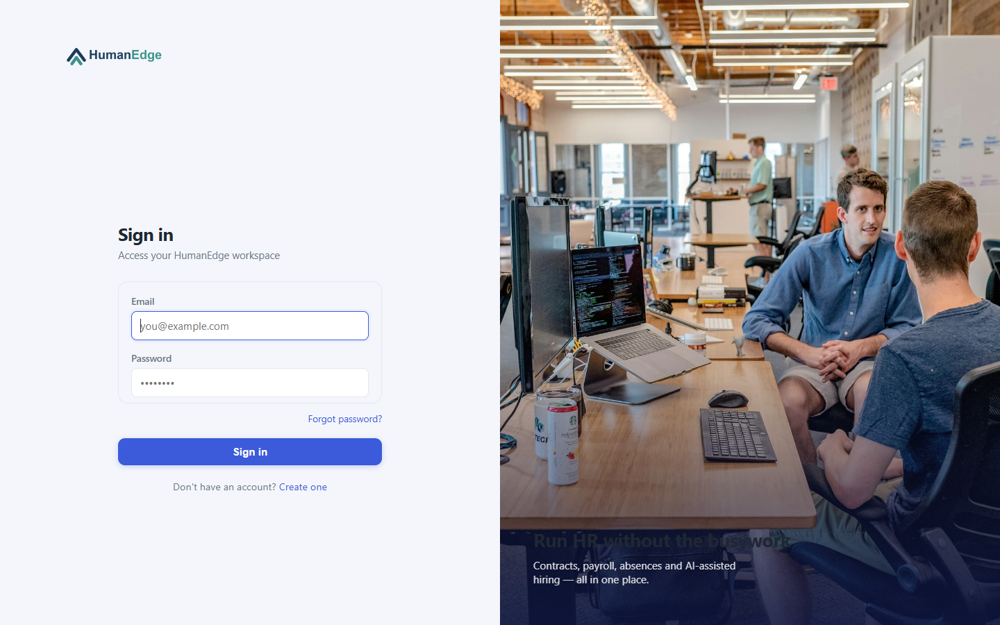

# HumanEdge — HR & Recruitment Management

[](https://github.com/abdessalemAttiaEsprit/HumanEdge/actions/workflows/backend-ci-cd.yml)
[](https://github.com/abdessalemAttiaEsprit/HumanEdge/actions/workflows/frontend-ci-cd.yml)
[](https://github.com/abdessalemAttiaEsprit/HumanEdge/actions/workflows/security-scan.yml)

Application de gestion RH (entreprises, personnel, contrats, absences, paie) avec un module
de recrutement assisté par IA : les CV des candidats sont évalués face à une offre d'emploi
par un LLM local (Ollama), qui renvoie un score et un feedback détaillé.

**Démo en ligne** : https://hr.human-edge.dev (déploiement GKE réel, budget étudiant - le
cluster peut être temporairement éteint entre deux sessions, voir
[docs/deployment/09-commandes-operationnelles.md](docs/deployment/09-commandes-operationnelles.md)).
Scénario de présentation avec captures d'écran : [docs/demo.md](docs/demo.md).



## Fonctionnalités

- **Authentification** : login/register, MFA par email (code à 6 chiffres) pour les comptes
  entreprise, lien de réinitialisation de mot de passe par email pour tous les comptes.
- **Multi-tenant entreprise** : inscription avec abonnement (plans simulés, sans vraie
  passerelle de paiement), gestion du personnel, contrats, absences, paie.
- **Recrutement** : offres d'emploi, candidatures, **évaluation de CV par IA** (score 0-100 +
  justification, via un LLM local Ollama - aucune donnée envoyée à un service tiers),
  planification d'entretiens.
- **Rôles** : `ADMIN` (vue plateforme), `COMPANY` (gestion de son entreprise), `GUEST`
  (candidat - postule aux offres, suit ses candidatures).

## Stack technique

| Composant | Technologies |
|---|---|
| Backend | Java 17, Spring Boot 3.5, Spring Security (JWT), Spring Data JPA, MySQL |
| Frontend | React 18, TypeScript, Vite, React Router, TanStack Query, Axios |
| IA | [Ollama](https://ollama.com) (`llama3.2:3b`), appelé en interne par le backend |
| Infra | Terraform (GCP/GKE), Kubernetes, Argo CD (GitOps), Docker |
| CI/CD | GitHub Actions → Docker Hub → bump GitOps, scans Trivy/SonarCloud/Snyk |
| Observabilité | Prometheus, Grafana (kube-prometheus-stack) |

Toute l'infra de déploiement (Terraform, Kubernetes, CI/CD, monitoring, sécurité) est
documentée pas-à-pas dans [docs/deployment/](docs/deployment/00-overview.md) - guide complet
pensé pour être rejoué de zéro sur un nouveau projet GCP.

## Démarrer en local

Prérequis : Docker + Docker Compose.

```bash
cp .env.example .env
# éditer .env : renseigner MAIL_USERNAME/MAIL_PASSWORD (App Password Gmail,
# voir les commentaires dans .env.example) - nécessaire pour les emails MFA/reset

docker compose up --build
```

- Frontend : http://localhost:8080
- Backend : http://localhost:8081 (`/actuator/health`)
- Compte admin par défaut : `admin@esprit.tn` / `admin` (créé automatiquement si la table
  `users` est vide - **à changer immédiatement en dehors d'un usage local**, voir
  [docs/deployment/07-checklist-securite-budget.md](docs/deployment/07-checklist-securite-budget.md)).

```bash
docker compose down -v   # arrêt + suppression des volumes (reset complet de la base)
```

## Structure du dépôt

```
backend/    Spring Boot (API REST, JWT, JPA, intégration Ollama)
frontend/   React + Vite + TypeScript (SPA)
infra/      Terraform (GCP/GKE) + manifestes Kubernetes (Kustomize) + Argo CD
docs/       Guide de déploiement pas-à-pas + récapitulatif + scénario de démo
.github/    Workflows CI/CD (build/test/push/scan + bump GitOps)
```

## Documentation

- [docs/deployment/00-overview.md](docs/deployment/00-overview.md) — vue d'ensemble de
  l'architecture et du budget GCP
- [docs/recap-deploiement-gke.md](docs/recap-deploiement-gke.md) — récapitulatif de tout ce
  qui a été mis en place (infra, CI/CD, sécurité, bugs corrigés, points encore ouverts)
- [docs/deployment/09-commandes-operationnelles.md](docs/deployment/09-commandes-operationnelles.md) —
  aide-mémoire des commandes courantes (déploiement, extinction/démarrage du cluster)
- [docs/deployment/10-qualite-securite-code.md](docs/deployment/10-qualite-securite-code.md) —
  intégration SonarQube/Snyk/Trivy dans la CI
- [docs/demo.md](docs/demo.md) — scénario de présentation avec captures d'écran
