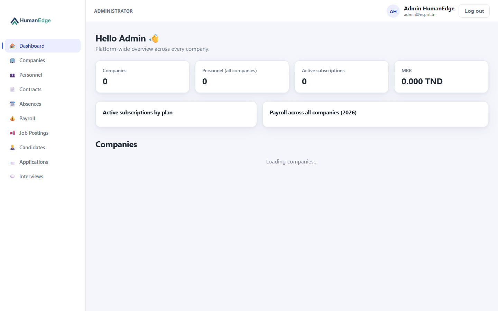
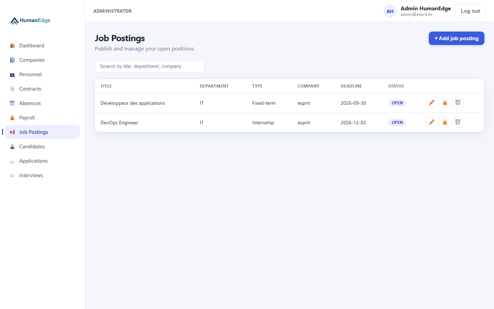
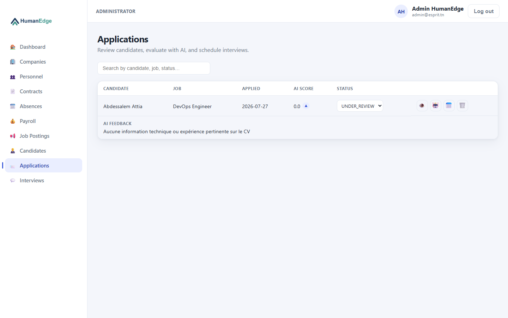
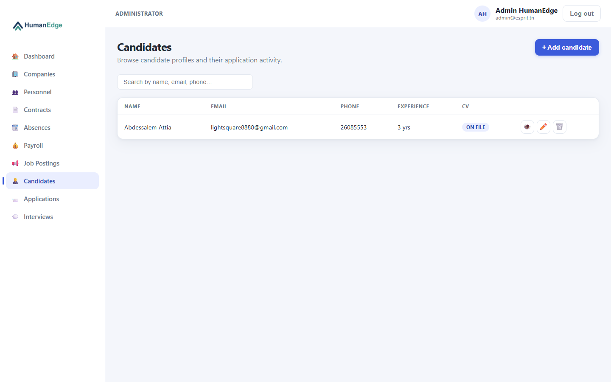
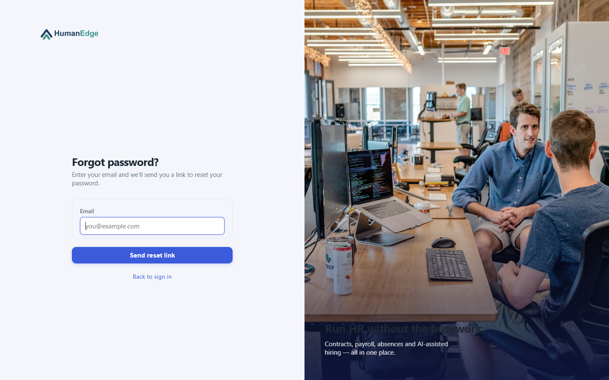

# Démo — scénario de présentation

Script pas-à-pas pour présenter l'application en live (soutenance, démo orale). Utilise
l'environnement de démo réel déployé sur GKE : **https://hr.human-edge.dev**.

> Le cluster est redimensionné à 0 nœud entre deux sessions de travail pour économiser le
> crédit GCP (voir [deployment/09-commandes-operationnelles.md](deployment/09-commandes-operationnelles.md))
> - si le site ne répond pas, il faut d'abord le rallumer.

## Comptes de démo

| Rôle | Email | Mot de passe | Remarque |
|---|---|---|---|
| Admin | `admin@esprit.tn` | `admin` | Compte créé automatiquement au premier démarrage, pas de MFA |
| Entreprise (COMPANY) | à créer via `/register/company` | - | Déclenche le flux MFA par email (voir étape 5) |
| Candidat (GUEST) | à créer via `/register/candidate` | - | Voir la mise en garde ci-dessous |

⚠️ Un compte candidat existe déjà en base avec un email de connexion différent de l'email de
profil affiché (confusion connue, non résolue - voir
[recap-deploiement-gke.md](recap-deploiement-gke.md#points-ouverts-à-ne-pas-considérer-comme-réglés)).
Pour la démo, préfère créer un **nouveau** compte candidat via `/register/candidate` plutôt
que de réutiliser celui-là.

## 1. Page de connexion

Ouvrir **https://hr.human-edge.dev/login**. Présente le design de l'écran d'auth (formulaire
+ image de marque) et le lien "Forgot password?" (fonctionnalité ajoutée cette session, voir
étape 6).

## 2. Connexion admin → tableau de bord

Se connecter avec `admin@esprit.tn` / `admin` (pas de MFA pour ce rôle, voir
`OtpService.requiresMfa` - volontairement exempté, un seul opérateur de confiance par
déploiement). Le tableau de bord montre une vue plateforme : nombre d'entreprises, effectifs,
abonnements actifs, MRR.

## 3. Offres d'emploi

Menu **Job Postings** : liste des offres publiées (titre, département, type de contrat,
entreprise, date limite, statut). Bouton **+ Add job posting** pour en créer une en live si
la démo le permet.

## 4. Évaluation IA d'une candidature (fonctionnalité phare)

Menu **Applications** : montre le score IA calculé par Ollama (`llama3.2:3b`, voir
[deployment/00-overview.md](deployment/00-overview.md)) pour chaque candidature, avec le
feedback détaillé en dessous. Cliquer sur le bouton 🤖 **Evaluate (AI)** d'une candidature
sans score déclenche un nouvel appel - **prévenir l'audience que ça prend 30 à 90 secondes**
(inférence CPU-only sur un nœud partagé, voir
[deployment/06-monitoring.md §6.7](deployment/06-monitoring.md#67-effet-de-bord-vécu--capacité-cpu-chroniquement-tendue)) :
c'est le bon moment pour expliquer l'architecture pendant que ça tourne plutôt que de rester
silencieux devant un spinner.

## 5. Candidats

Menu **Candidates** : profils des candidats (coordonnées, expérience, CV en pièce jointe).
Bouton 👁 pour prévisualiser le CV stocké sur le PVC Kubernetes.

## 6. Mot de passe oublié

Se déconnecter, puis **Forgot password?** depuis l'écran de connexion. Montre le flux par
lien email (token à usage unique, 45 min) plutôt qu'un code OTP - choix délibéré pour ne pas
dupliquer le mécanisme déjà en place pour le MFA de connexion des comptes COMPANY. Envoyer
une demande avec un email de test pour montrer l'email reçu (SMTP Gmail réel configuré,
voir [deployment/03-secrets.md](deployment/03-secrets.md)).

## 7. Points à mentionner si le temps le permet

- **MFA par email** pour les comptes COMPANY (`OtpService`) - créer un compte entreprise via
  `/register/company` pour le montrer en direct (paiement d'abonnement simulé,
  `PaymentSimulatorService`, pas de vraie carte bancaire nécessaire).
- **Infra complète derrière l'appli** : GKE, Terraform, Argo CD (GitOps), CI/CD GitHub
  Actions avec scan Trivy/SonarCloud/Snyk, monitoring Prometheus/Grafana - voir
  [deployment/00-overview.md](deployment/00-overview.md) et le
  [récapitulatif complet](recap-deploiement-gke.md).
- **Cloud SQL Auth Proxy + Workload Identity** : le backend s'authentifie à la base de
  données par IAM plutôt que par mot de passe réseau exposé - point sécurité à valoriser si
  le jury pose la question.
